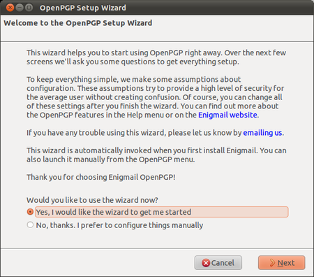
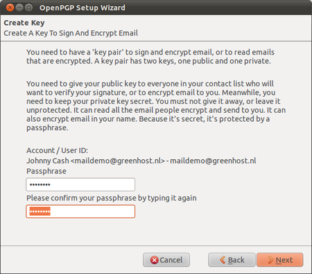
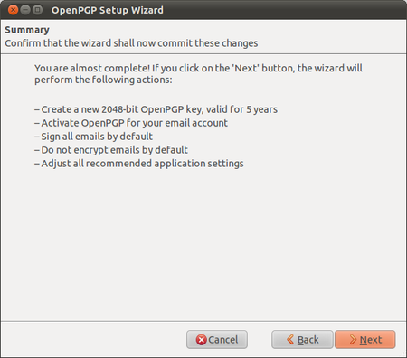

Creating your PGP keys
======================

You are now ready to start encryption your mails with PGP. You can do this by using Enigmail within Thunderbird. Enigmail comes with a nice wizard to help you with the initial setup and the important aspect of creating a public/private key pair (see the chapter introducing PGP for an explanation). You can start the wizard at any time within Thunderbird by selecting `OpenPGP > Setup Wizard` from the menu on top.

 1. This is what the wizard looks like. Please read the text on every window carefully. It provides useful information and helps you setup PGP to your personal preferences. In the first screen, click on Next to start the configuration.

 

 2. The wizard asks you whether you want to sign all your outgoing mail messages. If you do not chose to sign all your messages, you will have to specify per recipient if you want to sign your e-mail. Signing all your messages is a good choice. Click on the 'Next' button after you have made a decision.

 

 3. On the following screen, the wizard asks you whether you want to encrypt *all* your outgoing mail messages. Unlike signing of mails, encryption requires the recipient to have PGP software installed. Therefore you should answer 'no' to this question, to make sure you can still send normal mails. Only answer 'yes' here if you want to prevent Thunderbird from ever sending unencrypted mails. After you have made your decision, click on the 'Next' button.

 

 4. On the following screen the wizard asks if he can change some of your mail formatting settings to better work with PGP. It is a good choice to answer 'Yes' here. The only serious thing is that it will prevent you from doing is sending HTML mail messages. Click on the 'Next' button after you have made your decision.

 

 5. Now it is time to start creating the keys. In the following screen you can select one of your mail accounts, or the default one is selected for you if you have only one mail account. In the 'Passphrase' text box you have to give a password. This is a *new* password which is used to protect your private key. It is **very important** both to remember this password, because you cannot read your own encrypted emails any more when you lose it, and to make it a **strong** password. It should be at least 8 characters long, not contain any dictionary words and it should preferably be a **unique** password. Using the same password for multiple purposes severely increases the chance of it being intercepted at some point. After you have selected your account and created a passphrase, click on the 'Next' button.

 

 6. In the following screen the wizard basically wraps up what actions it will take to enable PGP encryption for your account. If you are satisfied with the options you chose in the previous windows, click on the 'Next' button.

 

 7. Your keys are being created by the wizard. Have some patience. The progress bar should slowly fill up to the right. The wizard will tell you when the keys have been successfully created, then you can click on the 'Next' button again.

 

 8. You now have your own PGP key-pair. The wizard will ask you if you also want to create a special file, called a 'Revocation certificate'. This file allows you to inform others that your key-pair should no longer be considered valid. Think of it as a 'kill switch' for your PGP identity. You can use this certificate in case you have generated a new set of keys, or in case your old key-pair has been compromised. It is a good idea to create the file and keep it somewhere in a safe place. Click on the 'Generate Certificate' button if you want to create the file, otherwise 'Skip'.

 

 9. Assuming you have decided to generate a revocation certificate, the wizard will ask you where the file should be saved. The dialog may appear a bit different on your particular operating system. It is a good idea to rename the file to something sensible like my_revocation_certificate. Click on 'Save' when you you have decided on a location.

 

 10. Assuming you have decided to generate a revocation certificate, the wizard informs you it has been successfully stored.

 

 11. The wizard will inform you it has completed its setup.

 

Congratulations, you now have a fully PGP-configured mail client. In the next chapter we will explain how to manage your keys, sign messages and do encryption. Thunderbird can help you do a lot of these things automatically.
