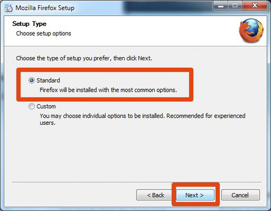
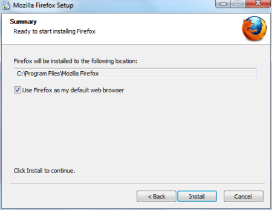

Installing Firefox on Windows
=============================

Firefox requires a computer with a minimum of a 233 MHz processor, running Windows 2000 or later. To check system requirements for Firefox, go to: [http://www.mozilla.com/firefox/system-requirements.html](http://www.mozilla.com/firefox/system-requirements.html)

Download and Install Firefox
----------------------------

 1. Visit the Firefox Download Page at [http://www.mozilla.com/firefox/](http://www.mozilla.com/firefox/) in any browser (such as Microsoft Internet Explorer). The download page automatically detects the operating system and language on your computer and recommends the best edition(s) of Firefox for you. If you want to download Firefox for a different language or for a different operating system than the one detected, click "Other Systems and Languages" to see a list of all the others available.

 

 2. Click the download button and the setup file will begin to download to your computer. Once the download completes, it is recommended that you exit all your running programs before running the installation.

 3. Double-click the file to start the Firefox install wizard.

    * If you are running Windows Vista, you may get a User Account Control prompt. In this case, allow the setup to run by clicking **Continue**.
    * If you are running Windows 7, you will be asked whether to allow Firefox to make changes to your computer. Click on **Yes**.

    A welcome screen appears.

 4. Click Next to continue. The Setup Type screen appears. A "Standard" setup is selected by default (using the custom option is only recommended for experienced users).

 

 5. Firefox installs itself as your default browser. If you do not want Firefox to be your default browser, clear the check box **Use Firefox as my default web browser**.

 

 6. Click **Next**.

 7. Firefox asks whether to import the settings, like bookmarks, from other browsers. Select the browser you are currently using, then click on **Next**.

 8. Firefox will confirm you have imported the setting and continue the installation. Click on **Continue**. Once Firefox has been installed, click **Finish** to close the setup wizard.

 

If the **Launch Firefox** now check box is checked, Firefox will start after you click **Finish**.

### Windows Vista Users

If at any time throughout the installation process you are prompted with a User Account Control (UAC) window, press Continue, Allow, or Accept.

Troubleshooting
---------------

If you have problems starting Firefox, see [http://support.mozilla.com/kb/Firefox+will+not+start](http://support.mozilla.com/kb/Firefox+will+not+start)
